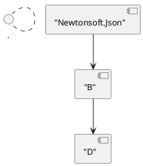

# Инструмент визуализации графа зависимостей (Вариант №26)

## Описание проекта

Инструмент предназначен для анализа и визуализации графов зависимостей пакетов **.NET (NuGet)**.  
Он реализован без использования встроенных средств NuGet и строит граф зависимостей полностью самостоятельно.

Функции проекта:

- получение прямых зависимостей пакета (NuGet API или тестовый файл);
- построение полного графа зависимостей (транзитивность, глубина, фильтрация, обработка циклов);
- работа в двух режимах: **реальный NuGet** и **тестовый репозиторий (A–Z)**;
- вычисление порядка загрузки зависимостей (топологическая сортировка);
- визуализация графа: **PlantUML** и **ASCII‑дерево**.

Проект реализует все этапы 1–5 варианта №26.

---

## Структура репозитория

```text
.
├── main.py
├── config.csv
├── test_dependencies.txt
├── requirements.txt
└── src/
    ├── config_reader.py
    ├── nuget_client.py
    ├── graph_builder.py
    ├── visualizer.py
    └── utils.py
```

---

## Этап 1 — Конфигурация (CSV)

Конфигурация берётся из `config.csv`.  
Пример:

```csv
PackageName,RepositoryUrl,IsTestMode,TestRepositoryPath,PackageVersion,MaxDepth,OutputImageFileName,ShowAsciiTree,FilterSubstring
Newtonsoft.Json,https://api.nuget.org/v3/index.json,true,test_dependencies.txt,13.0.1,3,dependency_graph.png,true,
```

Параметры:

- `PackageName` — анализируемый пакет  
- `RepositoryUrl` — URL NuGet v3  
- `IsTestMode` — режим тестового репозитория (true/false)  
- `TestRepositoryPath` — файл с тестовыми зависимостями  
- `PackageVersion` — версия пакета  
- `MaxDepth` — максимальная глубина BFS  
- `OutputImageFileName` — имя PNG  
- `ShowAsciiTree` — вывод ASCII дерева  
- `FilterSubstring` — фильтрация по подстроке

При запуске приложение выводит все параметры в формате ключ–значение.

---

## Этап 2 — Получение прямых зависимостей

### Режим NuGet
Через NuGet API (`registration5-gz-semver2`):

- загрузка JSON;
- извлечение dependencyGroups;
- фильтрация зависимостей при необходимости.

### Режим тестового репозитория
Формат файла:

```
A -> B, C; B -> D; C -> F; D -> ; E -> G; ...
```

Особенности:

- пакеты — **большие латинские буквы (A–Z)** согласно заданию;
- пустые зависимости обозначаются `D ->`;
- допускается одна строка с множеством правил, разделённых `;`.

В обоих режимах прямые зависимости выводятся в консоль.

---

## Этап 3 — Построение полного графа (BFS)

В `GraphBuilder`:

- граф хранится как  
  `nodes: Set[str]`,  
  `edges: Dict[str, List[str]]`;
- используется **BFS с рекурсией** (как требует вариант);
- применяется `MaxDepth`;
- `visited` предотвращает циклы;
- применяется фильтрация (`FilterSubstring`);
- поддерживаются оба режима получения зависимостей.

После построения выводится статистика:

```
Построен граф с N узлами и M связями
```

---

## Этап 4 — Порядок загрузки зависимостей

Реализована **топологическая сортировка**:

- обход соседей;
- защита от циклов через `temp_visited`;
- результат разворачивается для корректного порядка.

Вывод:

```
1. Newtonsoft.Json
2. C
3. F
4. ...
```

---

## Этап 5 — Визуализация (PlantUML / ASCII)

Язык диаграмм по заданию может быть **любой** — здесь используется PlantUML.

### PlantUML
Метод `generate_plantuml(graph)` формирует код:



`save_plantuml_image()`:

- сохраняет `.puml`;
- пытается вызвать `plantuml -tpng`;
- если утилита отсутствует, PNG не создаётся, но `.puml` остаётся.

### ASCII‑дерево

```
└── Newtonsoft.Json
    ├── B
    │   ├── D
    │   └── E
    │       └── G
    └── C
        └── F
```

---

## Инструкция по запуску

### Установка

```bash
pip install -r requirements.txt
```

### Запуск

```bash
python main.py
```

При запуске выполняются все этапы: конфигурация → зависимости → граф → сортировка → визуализация.

---

## Примеры использования

### 1. Тестовый репозиторий

Конфигурация:

```
IsTestMode = true
```

Запуск:

```bash
python main.py
```

Результат:

- анализ зависимостей из файла A–Z;
- визуализация;
- порядок загрузки.

### 2. Реальный NuGet — Newtonsoft.Json

```
PackageName = Newtonsoft.Json
IsTestMode = false
PackageVersion = 13.0.1
```

### 3. Реальный NuGet — NLog, Serilog

Меняем `PackageName`:

```
NLog
Serilog
```

---

## Сравнение со штатными средствами NuGet

Для проверки корректности:

```bash
dotnet new console -n TestProj
cd TestProj
dotnet add package Newtonsoft.Json --version 13.0.1
dotnet list package
```

Сравниваются:

- список прямых зависимостей;
- глубина графа;
- порядок загрузки;
- визуализация.

Важно:  
`dotnet list package` показывает зависимости **пакета в рамках проекта**,  
а инструмент строит **полный граф NuGet-пакетов**, поэтому структура может отличаться.

---

## Обработка ошибок

Обрабатываются:

- отсутствие `config.csv` или `test_dependencies.txt`;
- некорректные параметры;
- ошибки HTTP‑запросов к NuGet;
- неправильный формат данных;
- отсутствие PlantUML.

Ошибка выводится с пояснением, выполнение завершается корректно.

---

## Используемые алгоритмы

- **BFS с очередью и рекурсией** — построение графа;
- **топологическая сортировка** — порядок загрузки;
- **фильтрация зависимостей** — по подстроке;
- **обработка циклов** — через множества `visited` и `temp_visited`.

---

## Модули проекта

- `config_reader.py` — чтение/валидация конфигурации  
- `nuget_client.py` — зависимости (NuGet + тестовый файл)  
- `graph_builder.py` — BFS + топологическая сортировка  
- `visualizer.py` — PlantUML + ASCII‑дерево  
- `utils.py` — логирование  

---
